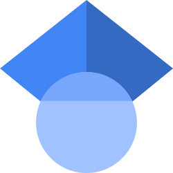

### Mathematics

Most of my research is centered around cluster algebras, a type of commutative ring with connections to many different areas of mathematics and physics. I often consider connections to skein algebras, knot theory, decorated Teichmüller spaces, and higher Teichmüller spaces, while using tools from commutative algebra, algebraic geometry, representation theory, and combinatorics.

### Papers

* **Deep Points of Cluster Algebras** ([arXiv:2403.15589](https://arxiv.org/abs/2403.15589)) 
    with [Greg Muller](https://math.ou.edu/~gmuller/)  
    *Int. Math. Res. Not. IMRN*, Volume 2025, Issue 4, February 2025 ([doi:10.1093/imrn/rnaf027](https://doi.org/10.1093/imrn/rnaf027)) 

    > We initiate a systematic study of the deep points of a cluster algebra; that is, the points in the associated variety which are not in any cluster torus. We describe the deep points of cluster algebras of type A, rank 2, Markov, and unpunctured surface type.

#### Preprints

* **Point Counts of Cluster Varieties of Marked Surfaces Over Finite Fields** ([arXiv:2608.22208](https://arxiv.org/abs/2608.22208))

    > We establish formulae for point counts of cluster varieties of cluster algebras of marked surfaces, possibly with punctures. We then establish formulae for the number of non-deep points in these cluster varieties over \\(\mathbb{F}_2\\), which gives us the number of algebraic tori necessary to cover the cluster manifold over \\(\mathbb{F}_2\\). We also show that these formulae satisfy certain recurrence relations.

* **Separating dots with circles** ([arXiv:2505.22851](https://arxiv.org/abs/2505.22851))  
    with [Jaewon Min](https://sites.google.com/view/jaewonmin/home) and Greg Muller

    > Given a finite set of points in general position in the plane or sphere, we count the number of ways to separate those points using two types of circles: circles through three of the points, and circles through none of the points (up to an equivalence). In each case, we show the number of circles which separate the points into subsets of size \\(k\\) and \\(l\\) is independent of the configuration of points, and we provide an explicit formula in each case. We also consider how the circles change as the configuration of dots varies continuously. We show that an associated higher order Voronoi decomposition of the sphere changes by a sequence of local moves. As a consequence, an associated cluster algebra is independent of the configuration of dots, and only depends on the number of dots and the order of the Voronoi decomposition.

    - [Circles and Dots](./circles-and-dots/index.html)
    - [Spherical Bicolored Higher Voronoi Diagrams](./higher-voronoi/index.html)

#### In Preparation

* **Cluster Algebras of Voronoi Decompositions**  
    with Jaewon Min and Greg Muller

    > Following *Separating Dots with Circles*, we show that a spherical bicolored order-\\(k\\) Voronoi decomposition admits a natural cluster structure.

* **Separating Curves in the Genus 2 Surface and the \\( X_7 \\) Cluster Algebra**  
    with Greg Muller

    > We establish a correspondence between separating curves in the genus 2 surface and a subset of cluster variables in the \\( X_7 \\) cluster algebra. We use this correspondence to show that the separating curve complex of the genus 2 surface is a six-dimensional pseudomanifold.

### PhD Dissertation

* **Deep Points of Cluster Varieties** ([ProQuest](https://www.proquest.com/docview/3199939057?sourcetype=Dissertations%20&%20Theses))

    > (Includes portions of the above paper *Deep Points of Cluster Algebras*.)   
    We describe the deep points of cluster algebras of unpunctured polygons, unpunctured marked surfaces, punctured polygons, and punctured surfaces with at least two boundary marked points. As a consequence, we classify the deep points of cluster algebras of types \\(A_n\\) and \\(D_n\\). We also classify the deep points of the Markov cluster algebra and its upper cluster algebra. 
    We then study the deep points of cluster algebras of types \\(B_n\\), \\(C_n\\), and \\(F_4\\) via foldings of quivers of types \\(A_{2n-1}\\), \\(D_{n+1}\\) and \\(E_6\\), respectively.

### Other

* **[OEIS sequence A308821](https://oeis.org/A308821)**: semiprimes where the sum of the digits equals the difference between the prime factors.

* For my MS, I wrote a survey paper on the curve complex. My advisor was Leah Childers.

### Links

